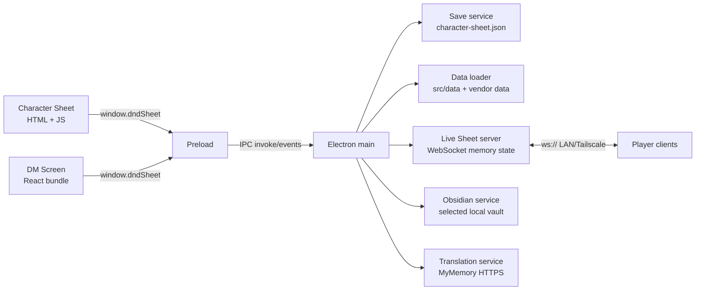

# Arquitectura

## Vista general

DnD-Plataform es una aplicación Electron de dos ventanas. El proceso main posee disco, red y APIs del sistema; preload expone IPC acotado; los renderers implementan la hoja de personaje y el DM Screen.

## Componentes de runtime

### Electron main

`src/app/main/main.js` crea las ventanas, configura auto-update, resuelve assets/tokens y registra IPC. Las ventanas usan `contextIsolation: true` y `nodeIntegration: false`. Los enlaces externos abiertos desde una ventana se restringen a HTTP/HTTPS.

### Preload

`src/app/preload/preload.js` publica `window.dndSheet`: saves, navegación, updater, carga de datos/PDF, tokens, Live Sheet y Obsidian. No expone `ipcRenderer` directamente.

### Character Sheet

`src/app/renderer/index.html` es el shell y contiene la mayor parte de la lógica de dominio, DOM y estado. `renderer.js` carga datos/PDF, inicializa UI y gestiona el cliente Live Sheet; `i18n.js` contiene diccionarios EN/ES. Algunos cálculos aislados se cargan como módulos UMD desde `src/engine`.

La ventana central de combate usa una frontera incremental:

- `src/engine/combat` mantiene definiciones, economía, reservas, pipeline y contrato de log como módulos puros UMD/CommonJS.
- `index.html` adapta el modelo real de la hoja (armas, spells, features, estados, slots, inventario) y ejecuta las tiradas existentes mediante `showDiceTray()`.
- `__sheetMeta.combatTurn` y `__sheetMeta.combatLog` persisten el turno/log con cada slot. Cancelar una sesión elimina la reserva sin consumir Action, slot, uso, munición ni consumible.
- El cliente no lee datos privados del DM: el target se elige por nombre visible desde el roster compartido y la UI no solicita AC. Salvo natural 1/20, Hit/Miss queda para confirmación del DM antes de habilitar Damage.

La ventana central mantiene un indice `Map` inmutable del catalogo y una fotografia revisionada de acciones. Una pasada comparte inventario, features, estados, Extra Attack y economia entre proveedores/render; los cambios relevantes invalidan esa fotografia.

### Carga de catalogos y PDF

`items:load` delega el catalogo vendor grande a `src/services/workers/item-data-worker.js`. El worker valida `mtime` y tamano de ambos JSON, reutiliza `userData/data-cache/items-catalog-v1.bin` cuando coincide y vuelve a compilarlo automaticamente cuando cambia la fuente. `data-loader.js` conserva ademas la promesa en memoria para solicitudes repetidas del mismo proceso.

La Character Sheet inicia esa carga junto con los demas datasets, pero no bloquea el primer render del PDF. Al completarse reconstruye equipo, AC, spells y combate; `pruneEquippedItems()` no elimina selecciones mientras el catalogo esta pendiente. PDF.js usa su worker empaquetado y las paginas visibles se procesan con concurrencia maxima dos para no saturar memoria/GPU.

No guardar el catalogo en `localStorage`: es sincrono, tiene cuota limitada y bloquearia el renderer. La cache binaria es derivada y descartable; nunca es fuente de verdad.

### DM Screen

`src/app/renderer/dm-screen/src/main.jsx` contiene el tablero React, bibliotecas, stat blocks, mapas/VTT, audio, jugadores en vivo, importación de personajes y Obsidian. Vite genera `dm-screen/dist/`, que está versionado porque Electron lo carga directamente. El estado ligero del tablero usa `localStorage`; imágenes de mapas y audio usan IndexedDB.

## Datos y estado

- `src/data`: classes, races, backgrounds, spells y bestiary propio/normalizado.
- `vendor/5etools-src-main/data`: feats, items, languages, conditions y datos de clase/race empaquetados selectivamente.
- `Tokens`: imágenes resueltas por source/name desde main.
- `character-sheet.json`: store v2 con seis slots. El servicio migra el objeto legado a `slot-1`, escribe atómicamente y conserva `character-sheet.json.bak` como último JSON válido.
- `__sheetMeta`: elecciones y estado generado asociado a una hoja; es parte del contrato de compatibilidad.

## Flujo de Live Sheet

1. El DM inicia `LiveSheetServer` desde el DM Screen.
2. Main escucha WebSocket en `0.0.0.0` y aplica límites de payload, sanitización y token opcional.
3. El jugador envía `player:hello`, `sheet:update`, tiradas, pings o estado de mano. El snapshot sigue excluyendo `__sheetMeta`, salvo `__liveStatuses`: una lista limitada de IDs de estados activos que permite al DM verlos y modificarlos desde la nota del personaje.
4. El servidor mantiene jugadores/VTT en memoria y emite snapshots por IPC al DM Screen.
5. Los datos remotos no se escriben automáticamente en slots locales.

Las tiradas del stepper de combate usan el mensaje existente `roll:event`. Los cambios de status del DM usan el patch existente `dm:sheet:patch`; el cliente normaliza los IDs, actualiza su `__sheetMeta.activeStatuses`, guarda y devuelve un snapshot. La economía y aplicación de efectos siguen siendo autoritativas sólo en modo local; todavía no existe un protocolo host/DM de solicitud-confirmación para mutaciones de combate. No presentar el estado `__sheetMeta.combatTurn` del cliente como autoridad multijugador.

No hay TLS, cuentas, relay ni persistencia de sesión. La frontera prevista es LAN privada o Tailscale.

## Localización

Inglés es fuente y default de la interfaz del jugador; español debe mantener paridad de claves. La traducción de descripciones usa MyMemory bajo acción del usuario y se cachea dentro de metadata de la hoja. El DM Screen contiene mayoritariamente texto español hardcoded y no comparte el sistema EN/ES completo.

## Extensión segura

- Cálculos puros nuevos: `src/engine/<domain>` más prueba Node.
- IO o integración: `src/services`, invocada desde main y expuesta de forma mínima por preload.
- Datos propios: `src/data`; no mezclar reglas ejecutables en JSON.
- Cambios en los monolitos: localizar marcadores/funciones con `docs/feature-map.md` y extraer una sola responsabilidad por vez.
- Cambios de saves o protocolo: mantener versión/compatibilidad y añadir migración/pruebas.

La dirección deseada es extracción incremental, no una arquitectura ya completada. Las carpetas con solo README no prueban que el subsistema esté implementado allí.
