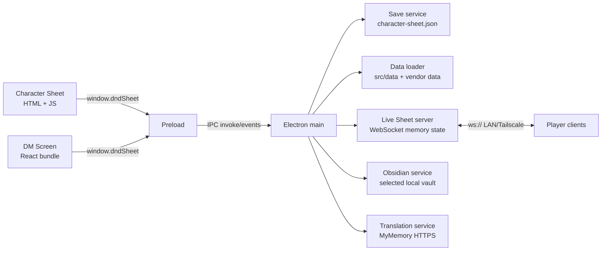

# Arquitectura

## Vista general

DnD-Plataform es una aplicación Electron de dos ventanas. El proceso main posee disco, red y APIs del sistema; preload expone IPC acotado; los renderers implementan la hoja de personaje y el DM Screen.

## Componentes de runtime

### Electron main

`src/app/main/main.js` crea las ventanas, configura auto-update, resuelve assets/tokens y registra IPC. Las ventanas usan `contextIsolation: true` y `nodeIntegration: false`. Los enlaces externos abiertos desde una ventana se restringen a HTTP/HTTPS.

### Preload

`src/app/preload/preload.js` publica `window.dndSheet`: saves, navegación, updater, carga de datos/PDF, tokens, Live Sheet y Obsidian. No expone `ipcRenderer` directamente.

### Character Sheet

`src/app/renderer/index.html` es el shell y contiene la mayor parte de la lógica de dominio, DOM y estado. `renderer.js` carga datos/PDF, inicializa UI y gestiona el cliente Live Sheet; `i18n.js` contiene diccionarios EN/ES; `dice-roller.js` dibuja dados 3D. Algunos cálculos aislados se cargan como módulos UMD desde `src/engine`.

### DM Screen

`src/app/renderer/dm-screen/src/main.jsx` contiene el tablero React, bibliotecas, stat blocks, mapas/VVT, audio, jugadores en vivo, importación de personajes y Obsidian. Vite genera `dm-screen/dist/`, que está versionado porque Electron lo carga directamente. El estado ligero del tablero usa `localStorage`; imágenes de mapas y audio usan IndexedDB.

## Datos y estado

- `src/data`: classes, races, backgrounds, spells y bestiary propio/normalizado.
- `vendor/5etools-src-main/data`: feats, items, languages, conditions y datos de clase/race empaquetados selectivamente.
- `Tokens`: imágenes resueltas por source/name desde main.
- `character-sheet.json`: store v2 con seis slots. El servicio migra el objeto legado a `slot-1`, escribe atómicamente y conserva `character-sheet.json.bak` como último JSON válido.
- `__sheetMeta`: elecciones y estado generado asociado a una hoja; es parte del contrato de compatibilidad.

## Flujo de Live Sheet

1. El DM inicia `LiveSheetServer` desde el DM Screen.
2. Main escucha WebSocket en `0.0.0.0` y aplica límites de payload, sanitización y token opcional.
3. El jugador envía `player:hello`, `sheet:update`, tiradas, pings o estado de mano.
4. El servidor mantiene jugadores/VVT en memoria y emite snapshots por IPC al DM Screen.
5. Los datos remotos no se escriben automáticamente en slots locales.

No hay TLS, cuentas, relay ni persistencia de sesión. La frontera prevista es LAN privada o Tailscale.

## Localización

Inglés es fuente y default de la interfaz del jugador; español debe mantener paridad de claves. La traducción de descripciones usa MyMemory bajo acción del usuario y se cachea dentro de metadata de la hoja. El DM Screen contiene mayoritariamente texto español hardcoded y no comparte el sistema EN/ES completo.

## Extensión segura

- Cálculos puros nuevos: `src/engine/<domain>` más prueba Node.
- IO o integración: `src/services`, invocada desde main y expuesta de forma mínima por preload.
- Datos propios: `src/data`; no mezclar reglas ejecutables en JSON.
- Cambios en los monolitos: localizar marcadores/funciones con `docs/feature-map.md` y extraer una sola responsabilidad por vez.
- Cambios de saves o protocolo: mantener versión/compatibilidad y añadir migración/pruebas.

La dirección deseada es extracción incremental, no una arquitectura ya completada. Las carpetas con solo README no prueban que el subsistema esté implementado allí.
