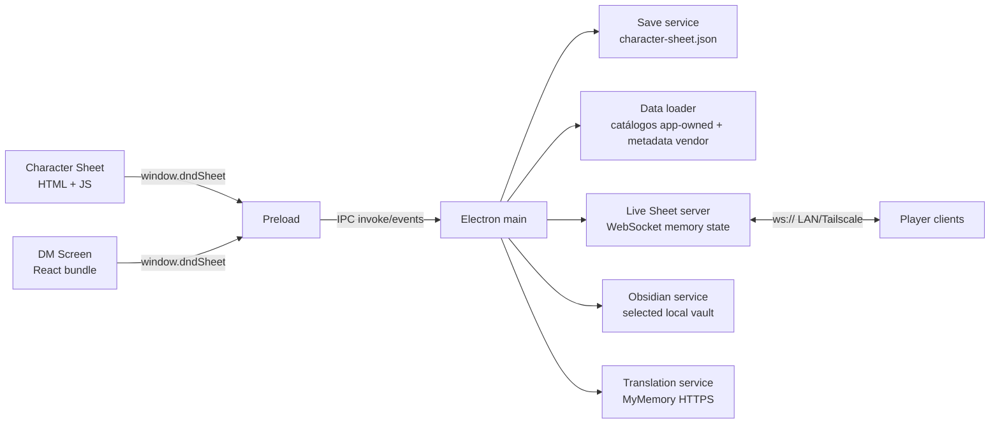

# Arquitectura

## Vista general

DnD-Plataform es una aplicación Electron de dos ventanas. El proceso main posee disco, red y APIs del sistema; preload expone IPC acotado; los renderers implementan la hoja de personaje y el DM Screen.

## Componentes de runtime

### Electron main

`src/app/main/main.js` crea las ventanas, configura auto-update, resuelve assets/tokens y registra IPC. Las ventanas usan `contextIsolation: true` y `nodeIntegration: false`. Los enlaces externos abiertos desde una ventana se restringen a HTTP/HTTPS.

### Preload

`src/app/preload/preload.js` publica `window.dndSheet`: saves, navegación, updater, carga de datos/PDF, tokens, Live Sheet y Obsidian. No expone `ipcRenderer` directamente.

### Character Sheet

`src/app/renderer/index.html` es el shell y contiene la mayor parte de la lógica de dominio, DOM y estado. `renderer.js` carga datos/PDF, inicializa UI y gestiona el cliente Live Sheet; `i18n.js` contiene diccionarios EN/ES. Algunos cálculos aislados se cargan como módulos UMD desde `src/engine`.

La ventana central de combate usa una frontera incremental:

- `src/engine/combat` mantiene definiciones, economía, reservas, pipeline y contrato de log como módulos puros UMD/CommonJS.
- `index.html` adapta el modelo real de la hoja (armas, spells, features, estados, slots, inventario) y ejecuta las tiradas existentes mediante `showDiceTray()`.
- `__sheetMeta.combatTurn` y `__sheetMeta.combatLog` persisten el turno/log con cada slot. Cancelar una sesión elimina la reserva sin consumir Action, slot, uso, munición ni consumible.
- El cliente no lee datos privados del DM: el target se elige desde el roster compartido usando un ID estable opaco y mostrando solo el nombre visible; siempre incluye el propio personaje y la UI no solicita AC. Salvo natural 1/20, Hit/Miss queda para confirmación del DM antes de habilitar Damage.
- Los cambios del snapshot/patch VTT invalidan la resolución visible para repintar targets sin crear un store paralelo. `spellRequiresCombat()` deriva disponibilidad desde metadata de la acción: la resolución guiada permite targets fuera de combate con coste cero cuando la acción no declara dependencia combativa.

La ventana central mantiene un indice `Map` inmutable del catalogo y una fotografia revisionada de acciones. Una pasada comparte inventario, features, estados, Extra Attack y economia entre proveedores/render; los cambios relevantes invalidan esa fotografia.

### Flujo VTT del jugador

Cuando el cliente Live Sheet conecta con el DM, abre la superficie completa de Combat y monta el VTT en `#combatMapViewport`. `renderer.js` mantiene el root oculto fuera de esa superficie; cerrar Combat no devuelve el mapa a la hoja ni crea una segunda ventana.

### Carga de catalogos y PDF

`items:load` delega el catálogo app-owned a `src/services/workers/item-data-worker.js`. El worker lee `src/data/items/items.json`, `items-base.json` e `item-automation.json`; firma tamaño/`mtime` de los tres y la versión del schema, reutiliza `userData/data-cache/items-catalog-v3.bin` cuando coincide y recompila al cambiar cualquier entrada. `data-loader.js` conserva además la promesa en memoria para solicitudes repetidas del mismo proceso.

`items.json.item` es la única colección oficial de primer nivel. Su identidad estable es `catalogId` (nombre+fuente+variante); `tombstone` conserva bajas compactas y nunca es seleccionable. Los `variants[].specificVariant` tienen identidad propia y se seleccionan desde su padre, pero no se convierten en filas superiores ni entran en el conteo activo de 2.253. `items-base.json` aporta properties/types/masteries y grupos, no un segundo catálogo `baseitem`. Las entregas parciales usan `--add-missing` para preservar el catálogo existente y agregar sólo identidades ausentes.

La mutación del catálogo ocurre fuera del runtime: `sync-items.js` calcula preview, aplica sólo con `--apply`, crea un backup gzip content-addressed y permite restaurarlo mediante un manifiesto v2 portable con rutas relativas y hashes; el restore escribe siempre en los targets actuales y conserva lectura de manifiestos v1. No recorre ni modifica saves de usuario. Equipment reconstruye la identidad desde nombre, fuente y variante (o acepta `catalogId` cuando existe), mientras las notas oficiales del DM persisten `catalogId` y snapshot. Las bajas quedan históricas/no disponibles y el homebrew permanece fuera de esta sincronización.

`src/engine/items/item-catalog.js` concentra identidad, materialización, metadata heredada y perfiles. El overlay separado se valida/resuelve/compila mediante `item-automation-schema.js`, `item-automation-registry.js` e `item-capability-compiler.js`; nunca altera el conteo canónico ni depende de narrativa. `item-resource-state.js` conserva el ledger legacy por `catalogId` y añade pools `catalogId::resourceId`; `src/engine/effects` crea instancias y despacha hooks genéricos. `index.html` persiste `itemResources`/`activeItemEffects`, revalida Equipment y sólo muta recursos/efectos tras confirmar. Ver `docs/ITEM_AUTOMATION.md`.

Los marcadores `__sheetMeta.itemEffects` continúan visibles como efectos manuales legacy; las activaciones nuevas usan instancias en `activeItemEffects`. Daño estructurado conserva componentes/tipos y hooks soportados, mientras geometría VTT, estado privado y reglas desconocidas quedan guiados. Varias copias de un `catalogId` aún comparten pools porque Equipment no tiene identidad de instancia. Tampoco existe un límite global de tres sintonizaciones ni migración automática de packs legacy.

La Character Sheet inicia esa carga junto con los demas datasets, pero no bloquea el primer render del PDF. Al completarse reconstruye equipo, AC, spells y combate; `pruneEquippedItems()` no elimina selecciones mientras el catalogo esta pendiente. PDF.js usa su worker empaquetado y las paginas visibles se procesan con concurrencia maxima dos para no saturar memoria/GPU.

No guardar el catalogo en `localStorage`: es sincrono, tiene cuota limitada y bloquearia el renderer. La cache binaria es derivada y descartable; nunca es fuente de verdad.

### DM Screen

`src/app/renderer/dm-screen/src/main.jsx` contiene el tablero React, bibliotecas, stat blocks, mapas/VTT, audio, jugadores en vivo, importación de personajes y Obsidian. La biblioteca de items importa sólo la colección activa app-owned. Una nota oficial persiste `catalogId` y snapshot: si una sincronización retira el registro, la nota conserva el detalle histórico marcado como unavailable, mientras el picker deja de ofrecerlo; `entryCustom` mantiene homebrew en una ruta distinta. Las notas de ítems homebrew ofrecen `Dar`: el DM envía al jugador una referencia `Equipment` y el snapshot `__homebrewItems` por el canal de patch; `index.html` lo incorpora a `__sheetMeta.homebrewItems` y reutiliza el drawer de inventario para mostrar descripción y funcionalidad textual, sin convertirlo en registro oficial ni inventar automatización de reglas. El Sound Bar guarda archivos locales en IndexedDB y enlaces YouTube como JSON atómico mediante `src/services/dm-sound-link-service.js`, a través de IPC; así los enlaces no dependen del perfil de caché de Chromium. Los enlaces persisten con nombre editable y Play abre un `YoutubeNote` visible, persistente, móvil y redimensionable; el iframe transmite el video sin extraer ni descargar previamente todo su contenido. Vite genera `dm-screen/dist/`, que es runtime generado e ignorado y debe regenerarse después de cambiar el source. El estado ligero del tablero usa `localStorage`; imágenes de mapas y audio usan IndexedDB.

Al seleccionar un Item en el picker del DM, `ResourcePicker` conserva el texto propio del registro y agrega las secciones de reglas heredadas de tipo, propiedad y maestria; los registros de grupo muestran tambien sus opciones concretas. Asi, los `entries` vacios del catalogo canonico no se traducen en un panel sin contenido.

## Datos y estado

- `src/data`: classes, races, backgrounds, spells, items y bestiary propio/normalizado. `src/data/items` incluye catálogo activo y metadata; preview, backups y manifiesto son artefactos de desarrollo excluidos explícitamente del paquete Electron.
- `vendor/5etools-src-main/data`: feats, languages, conditions y datos de clase/race empaquetados selectivamente; los JSON de items se conservan intactos como baseline de desarrollo, no como fuente activa empaquetada.
- `Tokens`: imágenes resueltas por source/name desde main.
- `character-sheet.json`: store v2 con seis slots. El servicio migra el objeto legado a `slot-1`, escribe atómicamente y conserva `character-sheet.json.bak` como último JSON válido.
- `__sheetMeta`: elecciones y estado generado asociado a una hoja; es parte del contrato de compatibilidad. En items, `itemAttunement`/`itemEffects` conservan claves por `catalogId`, recursos declarativos usan `catalogId::resourceId` y `activeItemEffects` guarda instancias estables; todavía no hay identidad de copia física.

## Flujo de Live Sheet

1. El DM inicia `LiveSheetServer` desde el DM Screen.
2. Main escucha WebSocket en `0.0.0.0` y aplica límites de payload, sanitización y token opcional.
3. El jugador envía `player:hello`, `sheet:update`, tiradas, pings o estado de mano. El snapshot sigue excluyendo `__sheetMeta`, salvo `__liveStatuses`: una lista limitada de IDs de estados activos que permite al DM verlos y modificarlos desde la nota del personaje.
4. El servidor mantiene jugadores/VTT en memoria y emite snapshots por IPC al DM Screen.
5. Los datos remotos no se escriben automáticamente en slots locales.

El audio local del Sound Bar se transmite como un `data:` URL limitado. Un enlace YouTube se valida en el DM Screen y el servidor solo acepta/transmite su video ID de once caracteres, nombre y volumen; el DM lo carga dentro de `YoutubeNote` y cada cliente conectado muestra un reproductor compacto visible desde `youtube-nocookie.com`. Pausa y reanudar usan el mismo control Live Sheet. Ambos renderers permiten exclusivamente ese origen en `frame-src` de su CSP. Los comandos salientes del player usan `postMessage(..., "*")` porque el iframe nace transitoriamente con origen `file://`; no contienen datos del usuario y los eventos entrantes siguen aceptándose solo desde `youtube-nocookie.com`. Como Chromium omite `Referer` al saltar desde `file://` a HTTPS, `configureYoutubeEmbedIdentity()` en main agrega únicamente a requests de `youtube-nocookie.com` el repositorio canónico como identidad HTTP; sin esa adaptación YouTube devuelve `Error 153`.

Las tiradas del stepper de combate usan el mensaje existente `roll:event`. Los cambios de status del DM usan el patch existente `dm:sheet:patch`; el cliente normaliza los IDs, actualiza su `__sheetMeta.activeStatuses`, guarda y devuelve un snapshot. La economía y aplicación de efectos siguen siendo autoritativas sólo en modo local; todavía no existe un protocolo host/DM de solicitud-confirmación para mutaciones de combate. El movimiento VTT es una excepción de visualización: el DM publica el presupuesto del participante activo y el jugador sólo lo refleja en su contador cuando coincide con su personaje. No presentar el estado `__sheetMeta.combatTurn` del cliente como autoridad multijugador.

No hay TLS, cuentas, relay ni persistencia de sesión. La frontera prevista es LAN privada o Tailscale.

## Localización

Inglés es fuente y default de la interfaz del jugador; español debe mantener paridad de claves. La traducción de descripciones usa MyMemory bajo acción del usuario y se cachea dentro de metadata de la hoja. El DM Screen contiene mayoritariamente texto español hardcoded y no comparte el sistema EN/ES completo.

## Extensión segura

- Cálculos puros nuevos: `src/engine/<domain>` más prueba Node.
- IO o integración: `src/services`, invocada desde main y expuesta de forma mínima por preload.
- Datos propios: `src/data`; no mezclar reglas ejecutables en JSON.
- Cambios en los monolitos: localizar marcadores/funciones con `docs/feature-map.md` y extraer una sola responsabilidad por vez.
- Cambios de saves o protocolo: mantener versión/compatibilidad y añadir migración/pruebas.

La dirección deseada es extracción incremental, no una arquitectura ya completada. Las carpetas con solo README no prueban que el subsistema esté implementado allí.

Los datos estructurados de un item no equivalen a automatización completa. Los adaptadores genéricos existentes cubren inventario/equipo, CA persistente segura, bonificadores de arma/saves/spell attack/spell DC, munición, consumibles, cargas numéricas y costes explícitos de conjuros anexos. Defensas equipadas se resumen pero no alteran daño/HP; condiciones, recargas aleatorias, descansos, targets, geometría, daño condicionado, efectos de mundo y excepciones abiertas se muestran como detalle o flujo manual guiado salvo que otro subsistema probado tenga una regla inequívoca.
